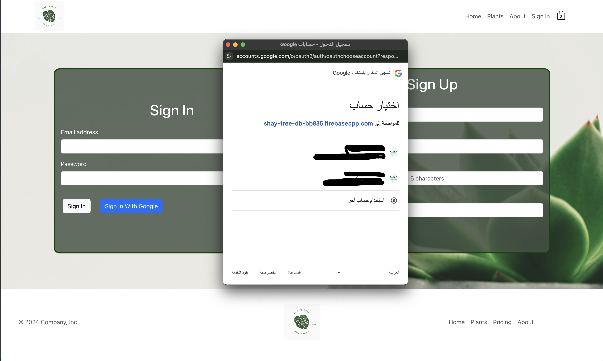

# Shay's Tree Plant Shop

### https://shays-tree.netlify.app/


---

## Overview

This is an e-commerce web application built for selling plants. Users can browse through a variety of plant categories, view product details, add items to their cart, and securely checkout using Stripe for payment. The app is fully responsive and styled with Bootstrap.


## Features

- User authentication with Firebase.
- Products categorized by plant types (indoor, outdoor, tropical, etc.).
- Context API for state management.
- Stripe integration for secure payments.
- Data storage and retrieval with Firestore.
- Responsive design with Bootstrap.
- Adding/Removing plants at checkout.
- Local storage for added items




## Tech Stack

- **Frontend**: React, Vite, Bootstrap
- **Backend**: Firebase (Authentication, Firestore)
- **Payment**: Stripe
- **State Management**: Context API


## Installation

To set up this project locally, follow these steps:

1. Clone the repository:

   ```bash
   git clone https://github.com/shay122990/shay-tree-plant-shop-react
   ```

2. Navigate into the project directory:

   ```bash
   cd shays-tree-vite
   ```

3. Install dependencies:

   ```bash
   npm install
   ```

4. Create a `.env` file in the root directory and add the following environment variables:

   - Firebase credentials
   - Stripe public key
   - Other relevant environment variables

5. Run the development server:

   ```bash
   npm run dev
   ```

6. To build the project for production:

   ```bash
   npm run build
   ```

7. To preview the production build:
   ```bash
   npm run preview
   ```

<!--  -->

## Usage

- Browse plants by categories.
- Add products to the cart.
- Checkout securely using Stripe.
- User authentication for personalized shopping.
- Come back to saved items

<!--  -->

## Firebase Setup

To use Firebase for authentication and data storage:

1. Set up a Firebase project [here](https://console.firebase.google.com/).
2. Enable Firestore and Authentication (Google Sign-In).
3. Add your Firebase credentials to your `.env` file:
   ```env
   VITE_FIREBASE_API_KEY=your-api-key
   VITE_FIREBASE_AUTH_DOMAIN=your-auth-domain
   VITE_FIREBASE_PROJECT_ID=your-project-id
   VITE_FIREBASE_STORAGE_BUCKET=your-storage-bucket
   VITE_FIREBASE_MESSAGING_SENDER_ID=your-sender-id
   VITE_FIREBASE_APP_ID=your-app-id
   ```

<!--  -->

## Stripe Setup

To enable Stripe for payments:

1. Create a Stripe account [here](https://stripe.com/).
2. Obtain your API keys from the Stripe dashboard.
3. Add your Stripe public key to the `.env` file:

   ```env
   VITE_STRIPE_PUBLIC_KEY=your-public-key
   ```

4. Use the `@stripe/react-stripe-js` and `@stripe/stripe-js` packages for integrating Stripe in your app.
5. For development purposes make sure you use default numbers given by Stipe (4242424242424242 04/42 424 42424)

<!--  -->

## State Management

The app uses React's Context API for state management. It manages global state for user authentication, the shopping cart, and products. The cart and user data are stored in contexts to allow easy access and updates from anywhere in the app.

## Persistence

The app uses local storage for your added items, so upon refresh or exit you can come back to the state you left it. Since this is a learning project I decided to use local storage, because it has not expiration, you can of course choose to use session storage or cookies. Developes choice.

## Contributing

Contributions are welcome! If you'd like to contribute, please follow these steps:

1. Fork the repository.
2. Create your feature branch (`git checkout -b feature/AmazingFeature`).
3. Commit your changes (`git commit -m 'Add some amazing feature'`).
4. Push to the branch (`git push origin feature/AmazingFeature`).
5. Open a Pull Request.

## License

This project is licensed under the MIT License. See the [LICENSE](LICENSE) file for more details.

---
